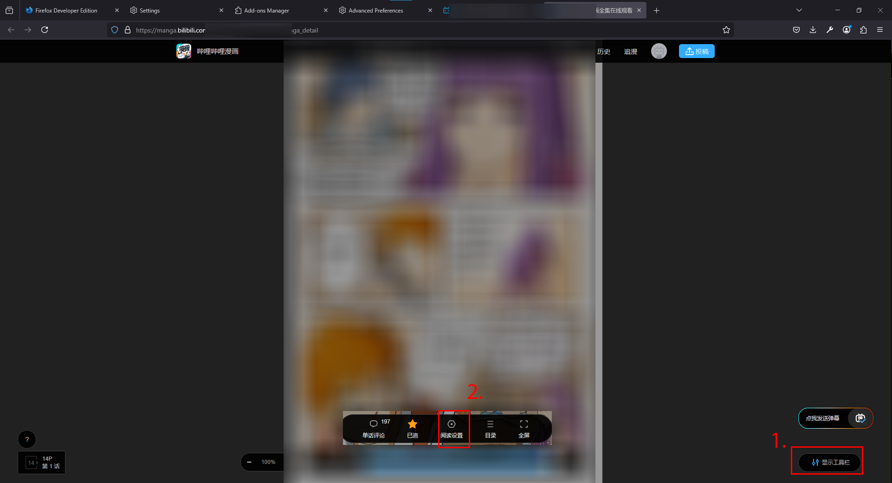
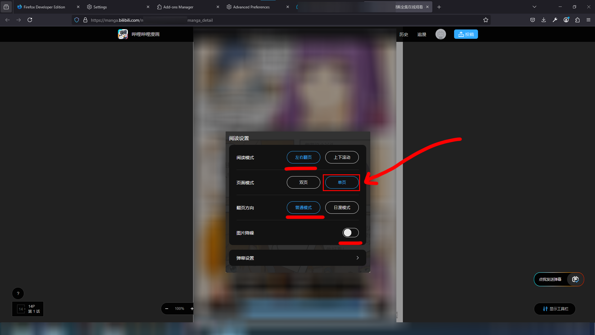
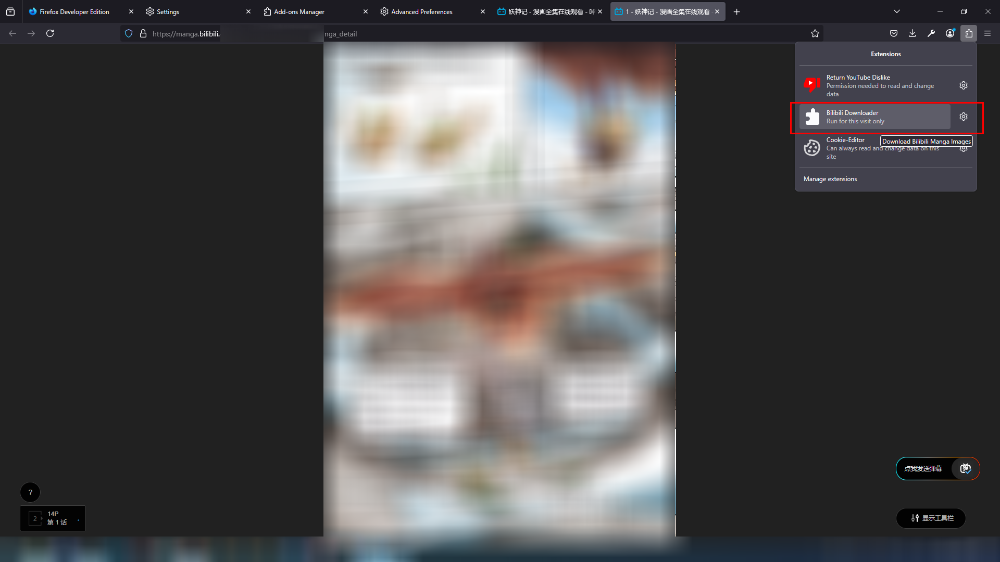

# Bilibili-comic-Downloader

### Check the Steps to use the Downloader. If the UIs aren't there for you, you can't download the manhua. This script was made to download the manhua the author wanted, this doesnt support all types of Images present on the website.
As you might know, most of the code stopped working after they released the newest version of their website. Specifically, they added so many security measures that breaking them was a time taking task, so instead I made the browser download the images itself, so we don't have to break the security. Although some security measures were breached. Kudos to their security though, Simple javascript code to execute on **Web Developer Tools** was't working, even with a lot of code it wasn't working, the final method was to make the browser do itself, not the javascript code, so had to create the extension.

## Major Steps
  1. You will have to install [Firefox Developer Edition](https://www.mozilla.org/en-US/firefox/developer/)
  2. Now, in the address tab, put ```about:config```, accept everything. we are changing it so that you are able to install custom addons. look for ```xpinstall.signatures.required``` and set it to false, just press the buttons until false appears next to it. done, close it.
  3. Install the addon from the release.

## Bilibili website steps
  1. Login to Bilibili website.
  2. Open the manhua chapter you want to download.
  3. You need to make sure that the reading is set "Left to Right" and the Reader's only "Single" mode. Refer to the Screenshots below. If there's no HUD, hover on the lower region of the website.
  4. After all is done, you need to slowly scroll the image slider such that all images are loaded, the again go to start of the page.
  5. Run the extension and do nothing, it'll automate your browser so don't click or do anything meanwhile. (it'll scroll the images)
  6. It'll download all images at once after it's finished.
  



